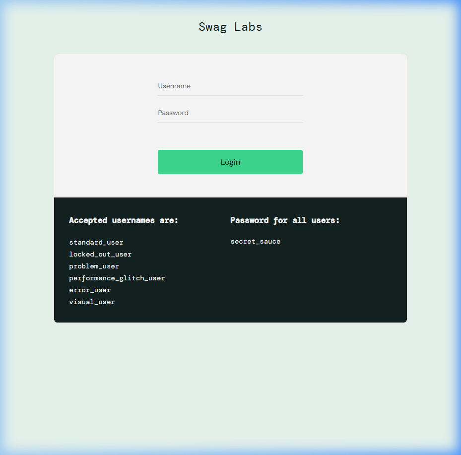
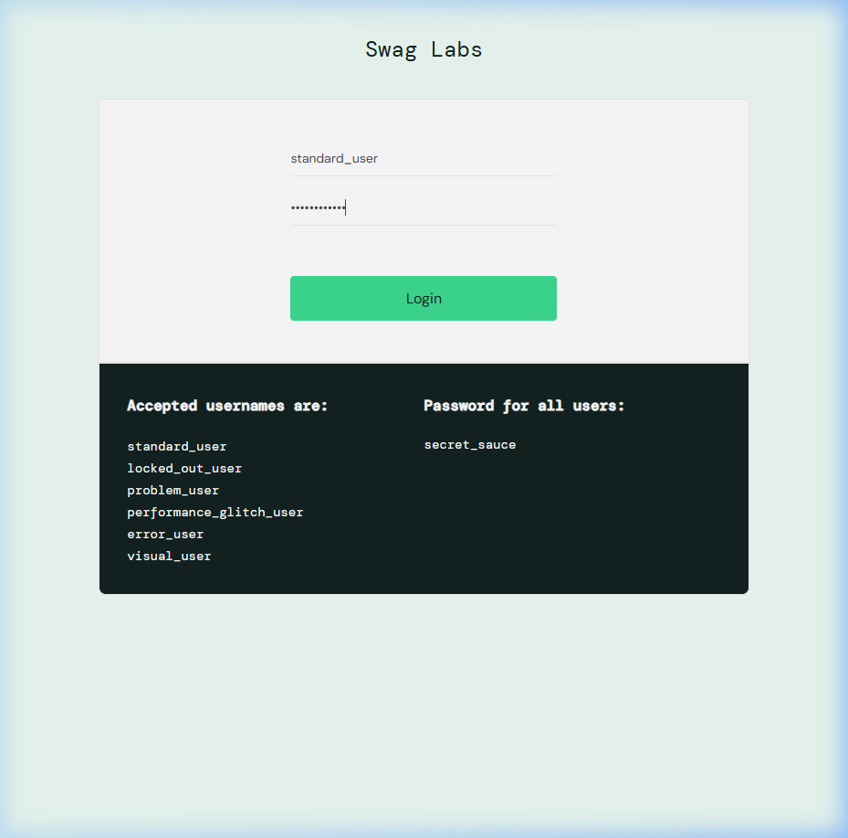
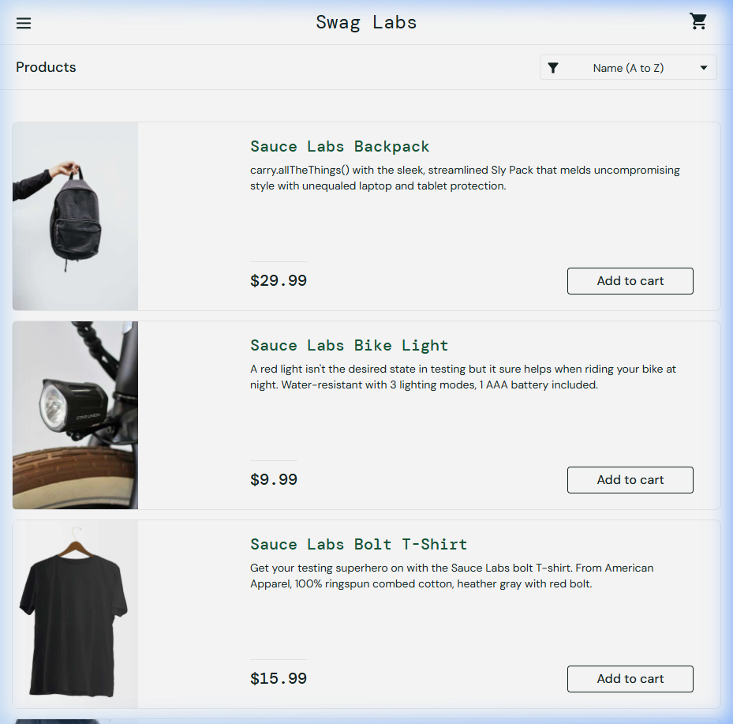
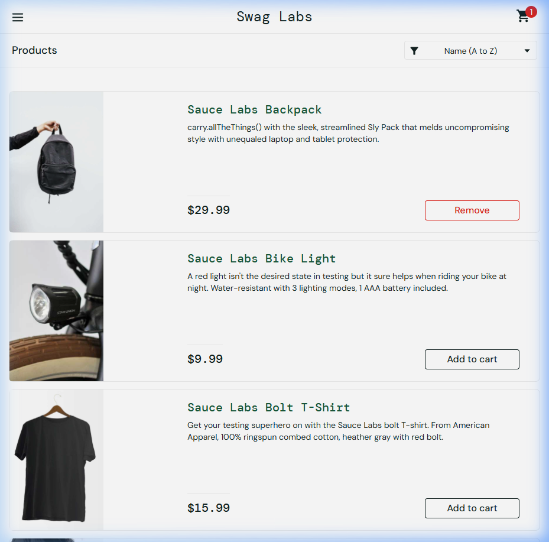
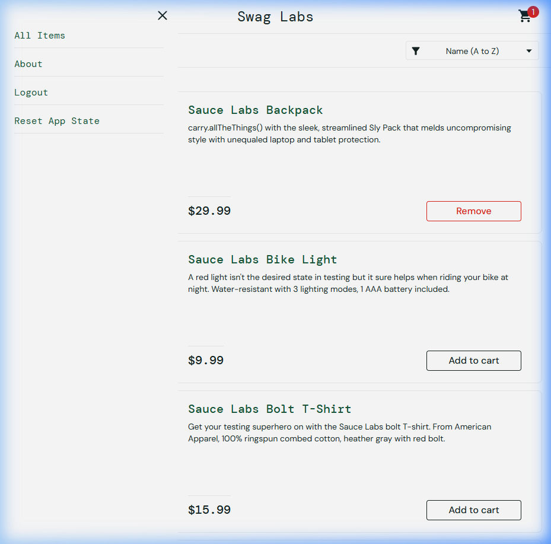

# 📋 BÁO CÁO THỰC HÀNH - Lab 9: Kiểm Thử Tự Động Giao Diện (UI E2E Testing)

> **Môn học:** Kiểm thử Phần mềm  
> **Nội dung:** Áp dụng kiểm thử tự động trên giao diện (UI E2E Testing) sử dụng Selenium WebDriver  
> **Website kiểm thử:** [Swag Labs - SauceDemo](https://www.saucedemo.com/)

---

## 📌 1. Giới Thiệu Dự Án

Dự án này thực hiện **kiểm thử tự động giao diện người dùng (UI End-to-End Testing)** trên trang thương mại điện tử demo **Swag Labs** (https://www.saucedemo.com/).

Mục tiêu là xây dựng các kịch bản kiểm thử tự động mô phỏng hành vi thực tế của người dùng, bao gồm: **đăng nhập**, **thêm sản phẩm vào giỏ hàng**, và **đăng xuất** — nhằm đảm bảo các chức năng cốt lõi của hệ thống thương mại điện tử hoạt động đúng như mong đợi.

---

## 🛠️ 2. Công Cụ Sử Dụng

| Công cụ | Phiên bản | Mô tả |
|---|---|---|
| **Java** | JDK 17+ | Ngôn ngữ lập trình chính |
| **Maven** | 3.9+ | Công cụ quản lý dự án và dependency |
| **Selenium WebDriver** | 4.33.0 | Thư viện tự động hóa trình duyệt web |
| **JUnit 5 (Jupiter)** | 5.11.4 | Framework tổ chức và chạy các test case |
| **Google Chrome** | Latest | Trình duyệt thực thi kiểm thử |
| **ChromeDriver** | Tự động quản lý bởi Selenium 4 | Driver điều khiển trình duyệt Chrome |

---

## 📂 3. Cấu Trúc Dự Án

```
Lab9_Selenium_Test/
├── pom.xml                                          # Cấu hình Maven
├── README.md                                        # Báo cáo thực hành (file này)
└── src/
    └── test/
        └── java/
            └── com/
                └── saucedemo/
                    └── SauceDemoUITest.java          # File chứa 3 Test Cases
```

---

## 🧪 4. Mô Tả Chi Tiết Các Test Cases

### ✅ Test Case 1: Đăng nhập thành công (Login)

| Thuộc tính | Chi tiết |
|---|---|
| **Tên test** | `testLoginSuccess()` |
| **Mô tả** | Kiểm tra chức năng đăng nhập với tài khoản hợp lệ |
| **Điều kiện tiên quyết** | Trình duyệt đã mở trang https://www.saucedemo.com/ |
| **Input** | Username: `standard_user` · Password: `secret_sauce` |
| **Các bước thực hiện** | 1. Mở trang SauceDemo → 2. Nhập Username → 3. Nhập Password → 4. Click nút **Login** |
| **Kết quả kỳ vọng** | ✔ URL chuyển sang `https://www.saucedemo.com/inventory.html` · ✔ Trang hiển thị tiêu đề **"Products"** |

---

### ✅ Test Case 2: Thêm sản phẩm vào giỏ hàng (Add to Cart)

| Thuộc tính | Chi tiết |
|---|---|
| **Tên test** | `testAddToCart()` |
| **Mô tả** | Kiểm tra việc thêm sản phẩm vào giỏ hàng sau khi đăng nhập |
| **Điều kiện tiên quyết** | Đã đăng nhập thành công vào hệ thống |
| **Input** | Sản phẩm: **Sauce Labs Backpack** |
| **Các bước thực hiện** | 1. Đăng nhập vào hệ thống → 2. Click nút **"Add to cart"** của sản phẩm Sauce Labs Backpack |
| **Kết quả kỳ vọng** | ✔ Biểu tượng giỏ hàng (`shopping_cart_badge`) xuất hiện · ✔ Badge hiển thị số **"1"** |

---

### ✅ Test Case 3: Đăng xuất khỏi hệ thống (Logout)

| Thuộc tính | Chi tiết |
|---|---|
| **Tên test** | `testLogout()` |
| **Mô tả** | Đảm bảo người dùng có thể đăng xuất an toàn khỏi hệ thống |
| **Điều kiện tiên quyết** | Đã đăng nhập thành công vào hệ thống |
| **Input** | Không có |
| **Các bước thực hiện** | 1. Đăng nhập → 2. Click nút **Menu** (☰ hamburger) → 3. Chờ sidebar menu mở hoàn toàn → 4. Click **"Logout"** |
| **Kết quả kỳ vọng** | ✔ Chuyển hướng về trang đăng nhập `https://www.saucedemo.com/` · ✔ Nút **Login** hiển thị trên trang |

> **💡 Lưu ý kỹ thuật:** Test Case 3 sử dụng `WebDriverWait` (Explicit Wait) để chờ Menu mở hoàn toàn và nút Logout trở nên clickable, tránh lỗi `ElementNotInteractableException`.

---

## 🚀 5. Hướng Dẫn Chạy Kiểm Thử

### Yêu cầu hệ thống
- **JDK 17** trở lên đã được cài đặt
- **Apache Maven** đã được cài đặt và cấu hình PATH
- **Google Chrome** (phiên bản mới nhất)

### Các bước thực hiện

```bash
# 1. Clone repository
git clone <URL_REPOSITORY>
cd Lab9_Selenium_Test

# 2. Chạy toàn bộ test
mvn clean test

# 3. (Tùy chọn) Chạy một test case cụ thể
mvn test -Dtest=SauceDemoUITest#testLoginSuccess
mvn test -Dtest=SauceDemoUITest#testAddToCart
mvn test -Dtest=SauceDemoUITest#testLogout
```

---

## 📊 6. Bằng Chứng Thực Thi

### 🔐 Test Case 1: Đăng nhập thành công

**Bước 1:** Mở trang SauceDemo - Hiển thị form đăng nhập



**Bước 2:** Nhập thông tin đăng nhập (Username: `standard_user`, Password: `secret_sauce`)



**Bước 3:** Sau khi click Login → Chuyển hướng thành công sang trang Products (`/inventory.html`) ✅



---

### 🛒 Test Case 2: Thêm sản phẩm vào giỏ hàng

Sau khi click **"Add to cart"** cho sản phẩm **Sauce Labs Backpack** → Badge giỏ hàng hiển thị số **"1"** ✅



---

### 🚪 Test Case 3: Đăng xuất khỏi hệ thống

**Bước 1:** Click nút Menu (☰) → Sidebar mở với option **Logout**



**Bước 2:** Click **Logout** → Chuyển hướng về trang đăng nhập ✅


---

### ✅ Kết Quả Chạy Test Tổng Hợp (Terminal)

```
[INFO] -------------------------------------------------------
[INFO]  T E S T S
[INFO] -------------------------------------------------------
[INFO] Running com.saucedemo.SauceDemoUITest
[INFO] Tests run: 3, Failures: 0, Errors: 0, Skipped: 0, Time elapsed: 11.33 s
[INFO]
[INFO] Results:
[INFO]
[INFO] Tests run: 3, Failures: 0, Errors: 0, Skipped: 0
[INFO]
[INFO] ------------------------------------------------------------------------
[INFO] BUILD SUCCESS
[INFO] ------------------------------------------------------------------------
[INFO] Total time:  15.834 s
[INFO] Finished at: 2026-06-22T09:38:16+07:00
[INFO] ------------------------------------------------------------------------
```

> ✅ **Kết quả:** Tất cả 3 test cases đều **PASS** thành công. Không có lỗi (Failures: 0, Errors: 0).

---

## 📝 7. Kết Luận

Qua bài thực hành này, tôi đã:

- ✅ Nắm được cách sử dụng **Selenium WebDriver 4.x** để tự động hóa kiểm thử giao diện web
- ✅ Hiểu cách tổ chức test case với **JUnit 5** (annotations: `@Test`, `@BeforeEach`, `@AfterEach`, `@DisplayName`, `@Order`)
- ✅ Áp dụng **Explicit Wait** (`WebDriverWait`) để xử lý các phần tử tải bất đồng bộ, tránh lỗi flaky test
- ✅ Xây dựng thành công **03 kịch bản kiểm thử tự động** cho trang thương mại điện tử SauceDemo
- ✅ Quản lý dự án kiểm thử bằng **Maven** và đẩy code lên **GitHub**

---

<p align="center">
  <i>Lab 9 - Kiểm thử Phần mềm · 2025</i>
</p>
